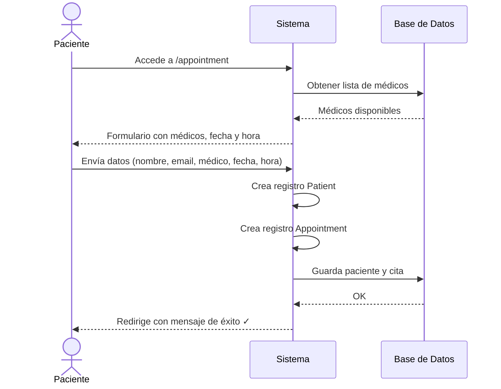
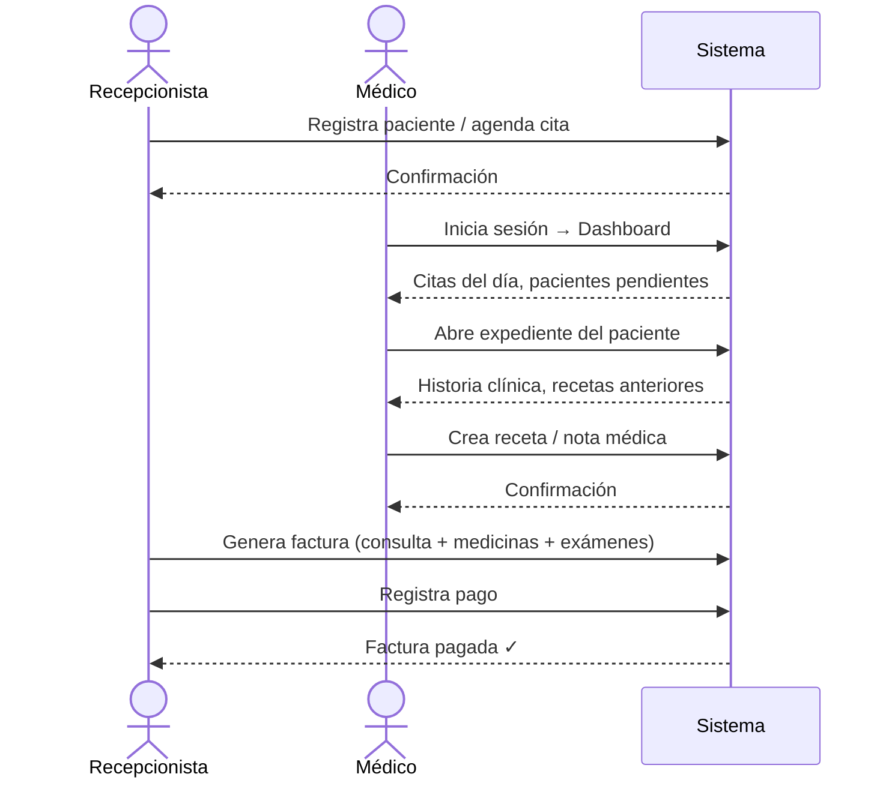
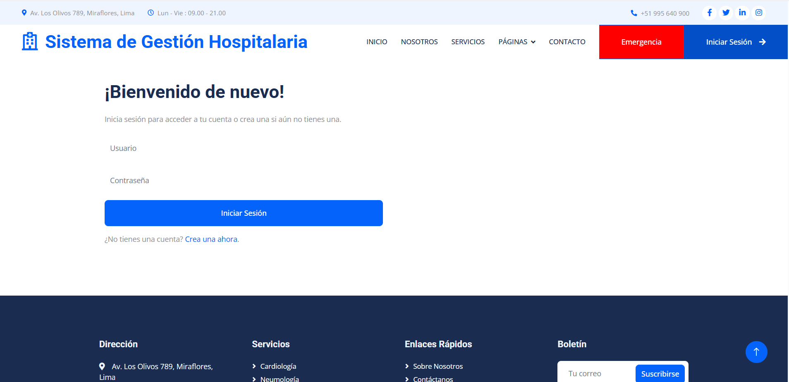
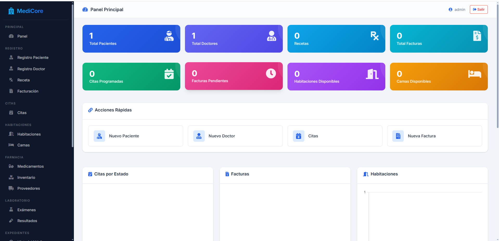

# 🏥 MediCore Hospital Management System

A full-stack web application for managing hospital operations — appointments, patients, doctors, billing, pharmacy, lab tests, and more. Built with **Spring Boot 3.2**, **Spring Security**, **Thymeleaf**, and **MySQL**.

---

## ✨ Features

### 🔐 Role-Based Access Control
Four roles with distinct dashboards and permissions:

| Role | Capabilities |
|------|-------------|
| **Admin** | Full system control — manage doctors, staff, departments, medicines, stock, suppliers, lab tests, insurances, users |
| **Doctor** | Manage appointments, write prescriptions, view/edit medical records, browse patient history |
| **Nurse** | View dashboard, manage beds, assist with patient care workflows |
| **Receptionist** | Register patients, book appointments, manage billing and payments |

### 📋 Module Overview

| Module | Description |
|--------|-------------|
| **Patient Management** | Register, search, edit, and maintain full patient history |
| **Appointment Scheduling** | Book, reschedule, complete, or cancel appointments with any doctor |
| **Doctor Management** | Register doctors, assign departments and specializations |
| **Prescriptions** | Create and manage prescriptions with dosage, duration, and medicine details |
| **Medical Records** | Store visit notes, diagnoses, symptoms, and treatments per patient |
| **Billing & Payments** | Generate patient bills (medicines + room + services + tests), record payments |
| **Pharmacy & Stock** | Manage medicine catalog, suppliers, and stock levels with expiry tracking |
| **Lab Management** | Configure lab tests, record test results with reference ranges |
| **Bed & Room Management** | Assign beds to patients, track availability across wards/ICUs |
| **Staff Management** | Manage non-doctor staff (nurses, receptionists) by department |
| **Insurance** | Link insurance policies to patients with coverage type and validity dates |

---

## 📊 Use Cases

### 👤 Actor — Role Mapping

| Actor | System Role |
|-------|------------|
| **Administrador** | ADMIN — full system control |
| **Médico** | DOCTOR — clinical workflows |
| **Enfermera(o)** | NURSE — patient and bed management |
| **Recepcionista** | RECEPTIONIST — registration, appointments, billing |

### 🎯 Core Use Cases

```mermaid
graph TD
    subgraph "Sistema de Gestión Hospitalaria (HMS)"
        A[Gestionar Pacientes] --> A1[Registrar Paciente]
        A --> A2[Buscar Paciente]
        A --> A3[Editar/Ver Historia]

        B[Gestionar Citas] --> B1[Agendar Cita]
        B --> B2[Completar/Eliminar Cita]
        B --> B3[Ver Calendario]

        C[Gestionar Consultas] --> C1[Crear Receta]
        C --> C2[Registrar Notas Médicas]
        C --> C3[Solicitar Exámenes]

        D[Gestionar Facturación] --> D1[Generar Factura]
        D --> D2[Registrar Pago]
        D --> D3[Ver Historial de Pagos]

        E[Gestionar Inventario] --> E1[Agregar Medicamento]
        E --> E2[Controlar Stock]
        E --> E3[Gestionar Proveedores]

        F[Gestionar Habitaciones] --> F1[Asignar Cama]
        F --> F2[Liberar Cama]
        F --> F3[Ver Disponibilidad]
    end

    ADMIN --> A & B & C & D & E & F
    DOCTOR --> B & C
    NURSE --> F
    RECEPTIONIST --> A & B & D
```



### 🔄 Flujo — Agendar Cita (Público)



### 🔄 Flujo — Atención al Paciente (Dashboard)



---

## 🖼️ Screenshots

> Para agregar capturas: tomá una foto de la pantalla, guardala en `screenshots/` como `.png`.

### Inicio de Sesión


### Dashboard del Administrador


### Pantalla Principal (Landing Page)


---

## 🛠️ Tech Stack

| Layer | Technology |
|-------|-----------|
| **Backend** | Java 17, Spring Boot 3.2.4, Spring MVC, Spring Data JPA / Hibernate |
| **Security** | Spring Security 6, BCrypt, Thymeleaf Extras Spring Security 6 |
| **Frontend** | Thymeleaf, HTML5, CSS3, Bootstrap, JavaScript |
| **Database** | MySQL 8+ |
| **Build Tool** | Maven |

---

## ⚙️ Getting Started

### Prerequisites
- Java 17 or later
- Maven 3.8+
- MySQL 8+ running on `localhost:3306`

### 1. Clone the repository

```bash
git clone https://github.com/Jaime-D-Z/medicore-hms.git
cd medicore-hms
```

### 2. Create the database

```sql
CREATE DATABASE hms1;
```

### 3. Configure database connection

Edit `src/main/resources/application.properties` if needed:

```properties
spring.datasource.url=jdbc:mysql://localhost:3306/hms1
spring.datasource.username=root
spring.datasource.password=
```

> Default credentials are `root` with an empty password. Change as needed.

### 4. Build and run

```bash
mvn clean install
mvn spring-boot:run
```

The app starts on **http://localhost:8080**.

### 5. Seed sample data (optional)

Run the seed script to populate all 20 tables with 5 sample rows each:

```bash
# Windows (PowerShell)
Get-Content seed-data.sql | mysql -u root hms1

# Linux / macOS
mysql -u root hms1 < seed-data.sql
```

---

## 🔑 Default Accounts

After running `DataInitializer` (runs automatically on startup):

| Username | Password | Role |
|----------|----------|------|
| `admin` | `admin123` | ADMIN |

After applying `seed-data.sql`:

| Username | Password | Role |
|----------|----------|------|
| `admin` | `password123` | ADMIN |
| `dr.smith` | `password123` | DOCTOR |
| `dr.garcia` | `password123` | DOCTOR |
| `nurse.amy` | `password123` | NURSE |
| `reception.claire` | `password123` | RECEPTIONIST |

---

## 🗄️ Database Schema (20 tables)

```
role ──── user_role ──── user
                           │
department ──── doctor     │
department ──── staff ─────┘
department ──── room ──── bed ──── patient
doctor ──────── appointment ────── patient
doctor ──────── prescription ───── patient
doctor ──────── medical_record ─── patient
doctor ──────── test_result ────── patient
                lab_test ─────────┘
medicine ────── stock ──── supplier
prescription ── patient_bill ──── payment
patient ─────── insurance
```

---

## 📁 Project Structure

```
src/
├── main/
│   ├── java/com/hms/
│   │   ├── config/          # Security, MVC, Data Initializer
│   │   ├── controller/      # 19 controllers (MVC)
│   │   ├── entity/          # 19 JPA entities
│   │   ├── repository/      # Spring Data JPA repositories
│   │   └── service/         # Business logic layer
│   ├── resources/
│   │   ├── static/          # CSS, JS, images, fonts
│   │   ├── templates/       # Thymeleaf templates
│   │   │   ├── fragments/   # Sidebar, navbar, footer
│   │   │   └── dashboard/   # All management views
│   │   └── application.properties
│   └── webapp/
└── test/
```

---

## 🌐 API Routes

### Public Pages
| Path | Description |
|------|-------------|
| `/` | Home page |
| `/signin` | Login page |
| `/createaccount` | User registration |
| `/service` | Services page |
| `/about` | About us |
| `/contact` | Contact form |
| `/appointment` | Book public appointment |

### Dashboard (authenticated)
| Path | Description |
|------|-------------|
| `/dashboard` | Role-based dashboard overview |
| `/dashboard/patients` | Manage patients (CRUD) |
| `/dashboard/appointments` | Manage appointments |
| `/dashboard/doctors` | Manage doctors (admin) |
| `/dashboard/prescriptions` | Manage prescriptions |
| `/dashboard/medicalRecords` | Medical records |
| `/dashboard/billing` | Patient billing |
| `/dashboard/payments` | Payment records |
| `/dashboard/medicines` | Pharmacy catalog |
| `/dashboard/stock` | Inventory management |
| `/dashboard/suppliers` | Supplier management |
| `/dashboard/rooms` | Room management |
| `/dashboard/beds` | Bed assignment |
| `/dashboard/labtests` | Lab test catalog |
| `/dashboard/testResults` | Test results |
| `/dashboard/insurances` | Insurance policies |
| `/dashboard/staff` | Staff management |
| `/dashboard/departments` | Department management |

---

## 🧪 Running Tests

```bash
mvn test
```

---

## 📄 License

This project is licensed under the **MIT License**.

---

> Built with Spring Boot 3.2 · Java 17 · MySQL 8
